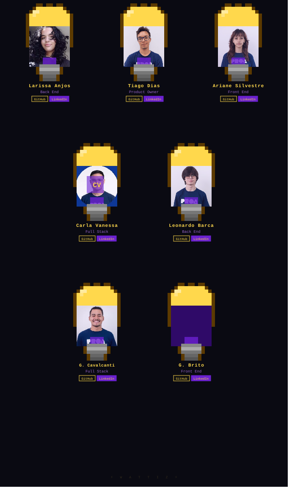

### ⚡ Monitore. Economize. Controle.
**Plataforma inteligente de monitoramento de energia para residências e pequenos negócios.**

<br/>

[](LICENSE)
[](https://react.dev)
[](https://github.com)

</div>

---

<div align="center">

## 🗂️ Índice

</div>

- [Sobre o Projeto](#sobre-o-projeto)
- [Funcionalidades](#funcionalidades)
- [Tecnologias](#tecnologias)
- [Como Começar](#como-começar)
  - [Pré-requisitos](#pré-requisitos)
  - [Instalação](#instalação)
- [Como Usar](#como-usar)
- [Roadmap](#roadmap)
- [Nosso Time](#nosso-time)
- [Licença](#licença)
- [Contato](#contato)

---

## Sobre o Projeto

> **Wattiz** é uma plataforma de monitoramento de energia elétrica em tempo real, desenvolvida para ajudar famílias e pequenos negócios a **entender, controlar e reduzir** seu consumo de energia — de forma simples, visual e inteligente.

Com o Wattiz, o usuário conecta seus dispositivos medidores ao sistema e passa a ter visibilidade total sobre o consumo da sua residência ou estabelecimento: por cômodo, por equipamento, por período. A plataforma ainda conta com **Lume**, nosso assistente virtual de energia, pronto para responder dúvidas e sugerir melhorias.

**Por que o Wattiz?**

- 💡 Visualize seu consumo em tempo real, sem complicação
- 📉 Identifique desperdícios e reduza sua conta de luz
- 🔌 Compatível com medidores de tomada e medidores digitais
- 🤖 Assistente inteligente integrado para tirar dúvidas e dar dicas
- 📱 Interface responsiva para desktop e mobile

<div align="right"><a href="#readme-top">↑ voltar ao topo</a></div>

---

## Funcionalidades

| Funcionalidade | Descrição |
|---|---|
| 📊 **Dashboard em tempo real** | Visualize o consumo atual de energia da sua casa ou negócio |
| 🔌 **Medidores inteligentes** | Compatível com tomadas medidoras e medidores digitais de parede |
| 🤖 **Assistente Lume** | IA integrada para dúvidas, alertas e dicas de economia |
| 👨‍👩‍👧 **Múltiplos perfis** | Suporte para famílias, residências e pequenos negócios |
| 📈 **Histórico e relatórios** | Acompanhe sua evolução ao longo do tempo |
| 🔐 **Autenticação segura** | Login protegido para seus dados de consumo |

<div align="right"><a href="#readme-top">↑ voltar ao topo</a></div>

---

## Tecnologias

As principais tecnologias utilizadas no desenvolvimento do Wattiz:

[](https://react.dev)
[](https://vitejs.dev)
[](https://developer.mozilla.org/docs/Web/JavaScript)
[](https://developer.mozilla.org/docs/Web/CSS)
[](https://nodejs.org)

<div align="right"><a href="#readme-top">↑ voltar ao topo</a></div>

---

## Como Começar

### Pré-requisitos

Certifique-se de ter o **Node.js** e o **npm** instalados na sua máquina.

```sh
# Verifique a versão do Node.js (recomendado v18+)
node -v

# Verifique a versão do npm
npm -v
```

### Instalação

1. Clone o repositório

```sh
git clone https://github.com/seu-usuario/wattiz.git
```

2. Acesse a pasta do projeto

```sh
cd wattiz
```

3. Instale as dependências

```sh
npm install
```

4. Inicie o servidor de desenvolvimento

```sh
npm run dev
```

5. Acesse no navegador

```
http://localhost:5173
```

<div align="right"><a href="#readme-top">↑ voltar ao topo</a></div>

---

## Como Usar

Após iniciar o projeto localmente:

1. **Crie sua conta** na tela de cadastro
2. **Conecte seu medidor** seguindo as instruções de configuração
3. **Acesse o dashboard** para visualizar o consumo em tempo real
4. **Converse com a Lume**, nossa assistente, para dicas personalizadas
5. **Acompanhe seu histórico** e veja sua evolução mês a mês

> Para mais detalhes, acesse nossa [Documentação](#).

<div align="right"><a href="#readme-top">↑ voltar ao topo</a></div>

---

## Roadmap

- [x] Landing page e identidade visual
- [x] Telas de autenticação (login / cadastro)
- [x] Dashboard de monitoramento
- [x] Integração com medidores de tomada
- [x] Assistente virtual Lume
- [ ] App mobile (React Native)
- [ ] Integração com concessionárias de energia
- [ ] Alertas automáticos por consumo anormal
- [ ] Relatórios em PDF exportáveis
- [ ] Suporte multilíngue (EN / ES)

Veja as [issues abertas](https://github.com/seu-usuario/wattiz/issues) para acompanhar o que está sendo desenvolvido.

<div align="right"><a href="#readme-top">↑ voltar ao topo</a></div>

---

## Nosso Time


## Nosso Time
 
<div align="center">
<br/>

<br/><br/>
 
<table>
  <tr>
    <td align="center" style="padding: 16px;">
      <a href="https://github.com/larissaanjosdev">
        
        <br/>
        <sub><b>Larissa Anjos</b></sub>
      </a>
      <br/>
      <sub>Back End</sub>
      <br/><br/>
      <a href="https://github.com/larissaanjosdev">
        
      </a>
      &nbsp;
      <a href="https://www.linkedin.com/in/larissa-dos-anjos-santos-76728a329/">
        
      </a>
    </td>
    <td align="center" style="padding: 16px;">
      <a href="https://github.com/Tiasgod">
        
        <br/>
        <sub><b>Tiago Dias</b></sub>
      </a>
      <br/>
      <sub>Product Owner</sub>
      <br/><br/>
      <a href="https://github.com/Tiasgod">
        
      </a>
      &nbsp;
      <a href="https://www.linkedin.com/in/tiagopdias-02-2004-ti/">
        
      </a>
    </td>
    <td align="center" style="padding: 16px;">
      <a href="https://github.com/Arianeslf">
        
        <br/>
        <sub><b>Ariane Silvestre</b></sub>
      </a>
      <br/>
      <sub>Front End</sub>
      <br/><br/>
      <a href="https://github.com/Arianeslf">
        
      </a>
      &nbsp;
      <a href="https://www.linkedin.com/in/ariane-silvestre-maira-632734236/">
        
      </a>
    </td>
  </tr>
  <tr>
    <td align="center" style="padding: 16px;">
      <a href="https://github.com/vanessa-py">
        
        <br/>
        <sub><b>Carla Vanessa</b></sub>
      </a>
      <br/>
      <sub>Full Stack</sub>
      <br/><br/>
      <a href="https://github.com/vanessa-py">
        
      </a>
      &nbsp;
      <a href="https://www.linkedin.com/in/carla-vanessa-souza">
        
      </a>
    </td>
    <td align="center" style="padding: 16px;">
      <a href="https://github.com/leonardobarca">
        
        <br/>
        <sub><b>Leonardo Barca</b></sub>
      </a>
      <br/>
      <sub>Back End</sub>
      <br/><br/>
      <a href="https://github.com/leonardobarca">
        
      </a>
      &nbsp;
      <a href="https://www.linkedin.com/in/leonardobarca/">
        
      </a>
    </td>
    <td align="center" style="padding: 16px;">
      <a href="https://github.com/GuilhermeMCavalcanti">
        
        <br/>
        <sub><b>Guilherme Cavalcanti</b></sub>
      </a>
      <br/>
      <sub>Full Stack</sub>
      <br/><br/>
      <a href="https://github.com/GuilhermeMCavalcanti">
        
      </a>
      &nbsp;
      <a href="https://www.linkedin.com/in/guilhermecavalcanti2005/">
        
      </a>
    </td>
  </tr>
  <tr>
    <td colspan="3" align="center" style="padding: 16px;">
      <a href="https://github.com/pedypowgui">
        
        <br/>
        <sub><b>Guilherme Brito</b></sub>
      </a>
      <br/>
      <sub>Front End</sub>
      <br/><br/>
      <a href="https://github.com/pedypowgui">
        
      </a>
      &nbsp;
      <a href="https://www.linkedin.com/in/guilhermebritodossantos/">
        
      </a>
    </td>
  </tr>
</table>
</div>
<div align="right"><a href="#readme-top">↑ voltar ao topo</a></div>
 

## Licença

Distribuído sob a licença MIT. Veja [`LICENSE`](LICENSE) para mais informações.

<div align="right"><a href="#readme-top">↑ voltar ao topo</a></div>

---

## Contato

**Wattiz** — plataforma de monitoramento de energia

[](mailto:contato@wattiz.com.br)
[](https://github.com/seu-usuario/wattiz)

<div align="right"><a href="#readme-top">↑ voltar ao topo</a></div>

---

<div align="center">

<br/>

Feito com ⚡ pelo time **Wattiz**

</div>
